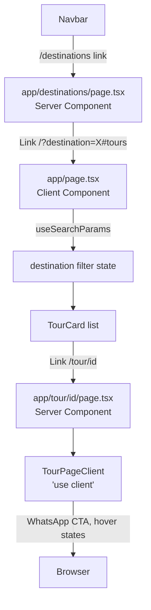

# Design Document: Tourism Destinations

## Overview

This feature adds a `/destinations` page, fixes the server-component error on `/tour/[id]`, enriches tour page content, updates the Navbar, and wires up destination-based pre-filtering on the home page.

The core architectural problem is that `app/tour/[id]/page.tsx` is a Server Component but directly attaches `onMouseEnter`/`onMouseLeave` to an `<a>` tag. In Next.js 15 App Router, Server Components cannot contain browser event handlers — doing so causes a build/runtime error. The fix is to extract all interactive elements into a `'use client'` component (`TourPageClient`).

The home page (`app/page.tsx`) is already a `'use client'` component with destination filter state. To support pre-filtering from the Destinations page, it needs to read the `destination` query parameter on mount and initialize the filter accordingly. Because `app/page.tsx` is a Client Component, it reads `searchParams` via `useSearchParams()` (not the async `props.searchParams` convention, which is for Server Components).

---

## Architecture



### Component Boundaries

| File | Type | Reason |
|---|---|---|
| `app/destinations/page.tsx` | Server Component | Static data, no interactivity needed |
| `app/tour/[id]/page.tsx` | Server Component | Data fetching, SEO metadata |
| `components/TourPageClient.tsx` | Client Component (`'use client'`) | Hover states, WhatsApp button animation |
| `components/Navbar.tsx` | Client Component (already) | Scroll state, mobile menu |
| `app/page.tsx` | Client Component (already) | Filter state, admin data fetching |

---

## Components and Interfaces

### `app/destinations/page.tsx`

Static Server Component. Imports `tours` from `data/tours.ts`, derives the 10 destinations with their tour counts, and renders a grid of `DestinationCard` elements (inline, no separate component file needed).

```ts
// Static metadata export
export const metadata: Metadata = {
  title: 'Egypt Tourism Destinations | Black Pyramids Tours',
  description: '...',
}

// Page component — no props needed (no dynamic params)
export default function DestinationsPage() { ... }
```

Each destination card is a `<Link href={`/?destination=${encodeURIComponent(name)}#tours`}>` — pure server-rendered HTML, no client state.

### `app/tour/[id]/page.tsx`

Async Server Component. Awaits `props.params` per Next.js 15 convention. Renders all static sections directly. Delegates interactive elements to `TourPageClient`.

```ts
type Props = { params: Promise<{ id: string }> }

export async function generateMetadata({ params }: Props): Promise<Metadata> {
  const { id } = await params
  const tour = tours.find(t => t.id === parseInt(id, 10))
  if (!tour) return {}
  return {
    title: `${tour.title} | Black Pyramids Tours`,
    description: tour.description,
  }
}

export default async function TourPage({ params }: Props) {
  const { id } = await params
  const tour = tours.find(t => t.id === parseInt(id, 10))
  if (!tour) notFound()
  // render static sections...
  // pass tour data to TourPageClient for interactive elements
  return (
    <>
      {/* static hero, overview, blog content, itinerary, inclusions, gallery, tips */}
      <TourPageClient tour={tour} />
    </>
  )
}
```

### `components/TourPageClient.tsx`

`'use client'` component. Receives the full `Tour` object as a prop. Renders:
- "Book via WhatsApp" button with hover animation
- "Back to All Tours" link with hover animation
- Any other elements requiring `onMouseEnter`/`onMouseLeave`

```ts
'use client'
import { Tour } from '@/data/tours'

export default function TourPageClient({ tour }: { tour: Tour }) { ... }
```

### `components/Navbar.tsx`

Add `{ label: 'Destinations', href: '/destinations' }` to the links array. Use `usePathname()` to detect the active route and apply gold color + underline to the matching link.

### `app/page.tsx`

Add `useSearchParams()` hook. On mount (or when searchParams changes), read the `destination` param and call `setDest()` if it matches a valid destination. Also call `document.getElementById('tours')?.scrollIntoView()` when the param is present.

The `DESTINATIONS` constant needs to be updated to include all 10 destinations: `'Cairo & Giza' | 'Luxor' | 'Aswan' | 'Alexandria' | 'Sinai' | 'Hurghada' | 'Fayoum' | 'White Desert' | 'El Minya' | 'Red Sea'`.

---

## Data Models

### Destination static data (inline in `app/destinations/page.tsx`)

```ts
interface DestinationMeta {
  name: Tour['destination']          // matches the union type in data/tours.ts
  heroImage: string                  // Unsplash URL
  description: string                // 2–3 sentence description
  tourCount: number                  // derived: tours.filter(t => t.destination === name).length
}
```

The 10 destinations with Unsplash hero images:

| Destination | Unsplash URL |
|---|---|
| Cairo & Giza | `https://images.unsplash.com/photo-1539768942893-daf53e448371?w=800&fit=crop` |
| Luxor | `https://images.unsplash.com/photo-1568322445389-f64ac2515020?w=800&fit=crop` |
| Aswan | `https://images.unsplash.com/photo-1553913861-c0fddf2619ee?w=800&fit=crop` |
| Alexandria | `https://images.unsplash.com/photo-1572252009286-268acec5ca0a?w=800&fit=crop` |
| Sinai | `https://images.unsplash.com/photo-1544551763-46a013bb70d5?w=800&fit=crop` |
| Hurghada | `https://images.unsplash.com/photo-1559827260-dc66d52bef19?w=800&fit=crop` |
| Fayoum | `https://images.unsplash.com/photo-1518684079-3c830dcef090?w=800&fit=crop` |
| White Desert | `https://images.unsplash.com/photo-1509316785289-025f5b846b35?w=800&fit=crop` |
| El Minya | `https://images.unsplash.com/photo-1601597111158-2fceff292cdc?w=800&fit=crop` |
| Red Sea | `https://images.unsplash.com/photo-1544551763-77ef2d0cfc6c?w=800&fit=crop` |

### Tour data (existing `data/tours.ts`)

No changes to the `Tour` interface or data. The `destination` field union type already covers all 10 destinations.

### Blog content per destination (inline in `app/tour/[id]/page.tsx`)

A `Record<Tour['destination'], { history: string[]; tips: string[] }>` map provides destination-specific paragraphs and travel tips. This is a static lookup keyed on `tour.destination`, defined in the page file.

---

## Correctness Properties

*A property is a characteristic or behavior that should hold true across all valid executions of a system — essentially, a formal statement about what the system should do. Properties serve as the bridge between human-readable specifications and machine-verifiable correctness guarantees.*

### Property 1: TourCard link targets the correct tour URL

*For any* tour in `data/tours.ts`, rendering `TourCard` for that tour should produce a link whose `href` equals `/tour/{tour.id}` and whose `target` equals `_blank`.

**Validates: Requirements 2.1, 2.2**

### Property 2: Destination card link encodes the correct filter URL

*For any* destination in the 10-destination list, rendering its card should produce a link whose `href` equals `/?destination={encodeURIComponent(destination)}#tours`.

**Validates: Requirements 4.4**

### Property 3: Destination card renders all required fields

*For any* destination in the destinations data, its rendered card should contain the destination name, a non-empty image src, a non-empty description, and a tour count that equals the number of tours in `data/tours.ts` with that destination value.

**Validates: Requirements 4.3**

### Property 4: generateMetadata returns correctly formatted title and description

*For any* tour in `data/tours.ts`, calling `generateMetadata` with that tour's id should return a `title` of the form `"{tour.title} | Black Pyramids Tours"` and a `description` equal to `tour.description`.

**Validates: Requirements 7.1, 7.3**

### Property 5: Home page destination filter initializes from query param

*For any* valid destination string (one of the 10 destinations), when the home page is rendered with `?destination={value}`, the destination filter state should be initialized to that value and the filtered tour list should contain only tours matching that destination.

**Validates: Requirements 6.1**

### Property 6: Navbar active link matches current pathname

*For any* pathname, rendering the Navbar should apply the active style to exactly the link whose `href` matches that pathname, and no other link.

**Validates: Requirements 5.2**

---

## Error Handling

### Invalid tour ID (`/tour/[id]`)
- `parseInt(id, 10)` returns `NaN` for non-numeric segments → `tours.find()` returns `undefined` → `notFound()` is called → Next.js renders the nearest `not-found.tsx` or the default 404 page.
- No try/catch needed since `data/tours.ts` is a static import (no async I/O).

### Invalid destination query param (`/?destination=X`)
- The `useSearchParams()` value is checked against the `DESTINATIONS` array. If not found, `setDest('All')` is called (default). No error is thrown.

### Missing tour images
- `tour.images` may be `undefined` or empty. The fallback `const allImages = tour.images?.length ? tour.images : [tour.image]` is applied in both `TourPage` and `TourPageClient`.

### `generateMetadata` for unknown tour
- If `params.id` doesn't match any tour, return `{}` (empty metadata object) rather than throwing. `notFound()` in the page component handles the 404 rendering.

---

## Testing Strategy

This feature is primarily UI rendering and routing — Server Components, Client Components, and navigation links. PBT applies to the pure logic properties (link URL construction, metadata generation, filter initialization). UI layout and CSS are not property-tested.

**Property-based testing library**: `fast-check` (already common in the JS/TS ecosystem; install with `npm install --save-dev fast-check`).

Each property test runs a minimum of 100 iterations.

### Unit / Example Tests

- `TourPage` renders `notFound()` for an unknown id (edge case 1.4)
- `DestinationsPage` renders exactly 10 destination cards (example 4.2)
- `DestinationsPage` renders a hero section with title and subtitle (example 4.5)
- `Navbar` contains a link to `/destinations` (example 5.1)
- `Navbar` preserves all original links (example 5.3)
- `metadata` export from `DestinationsPage` has the correct title (example 7.2)
- Home page renders 11 filter pills (All + 10 destinations) (example 6.4)

### Property-Based Tests

**Property 1** — `TourCard` link URL
```
// Feature: tourism-destinations, Property 1: TourCard link targets the correct tour URL
fc.assert(fc.property(fc.constantFrom(...tours), (tour) => {
  const { container } = render(<TourCard tour={tour} />)
  const link = container.querySelector('a')
  return link?.href.endsWith(`/tour/${tour.id}`) && link?.target === '_blank'
}), { numRuns: 100 })
```

**Property 2** — Destination card link URL
```
// Feature: tourism-destinations, Property 2: Destination card link encodes the correct filter URL
fc.assert(fc.property(fc.constantFrom(...DESTINATIONS), (dest) => {
  const { container } = render(<DestinationCard destination={dest} ... />)
  const link = container.querySelector('a')
  const expected = `/?destination=${encodeURIComponent(dest)}#tours`
  return link?.getAttribute('href') === expected
}), { numRuns: 100 })
```

**Property 3** — Destination card required fields
```
// Feature: tourism-destinations, Property 3: Destination card renders all required fields
fc.assert(fc.property(fc.constantFrom(...destinationsData), (d) => {
  const { getByText, container } = render(<DestinationCard {...d} />)
  const hasName = !!getByText(d.name)
  const hasImg = !!container.querySelector(`img[src="${d.heroImage}"]`)
  const hasDesc = container.textContent?.includes(d.description.slice(0, 20))
  const hasCount = container.textContent?.includes(String(d.tourCount))
  return hasName && hasImg && hasDesc && hasCount
}), { numRuns: 100 })
```

**Property 4** — `generateMetadata` format
```
// Feature: tourism-destinations, Property 4: generateMetadata returns correctly formatted title and description
fc.assert(fc.property(fc.constantFrom(...tours), async (tour) => {
  const meta = await generateMetadata({ params: Promise.resolve({ id: String(tour.id) }) })
  return meta.title === `${tour.title} | Black Pyramids Tours`
    && meta.description === tour.description
}), { numRuns: 100 })
```

**Property 5** — Home page filter initialization
```
// Feature: tourism-destinations, Property 5: Home page destination filter initializes from query param
fc.assert(fc.property(fc.constantFrom(...VALID_DESTINATIONS), (dest) => {
  // render with mocked useSearchParams returning { destination: dest }
  const { getAllByTestId } = render(<HomeToursSection initialDest={dest} tours={tours} />)
  const cards = getAllByTestId('tour-card')
  return cards.every(card => card.dataset.destination === dest)
}), { numRuns: 100 })
```

**Property 6** — Navbar active link
```
// Feature: tourism-destinations, Property 6: Navbar active link matches current pathname
fc.assert(fc.property(fc.constantFrom('/', '/destinations', '/tour/1'), (pathname) => {
  // render with mocked usePathname returning pathname
  const { container } = render(<Navbar />)
  const activeLinks = container.querySelectorAll('[data-active="true"]')
  return activeLinks.length <= 1
    && (activeLinks.length === 0 || activeLinks[0].getAttribute('href') === pathname)
}), { numRuns: 100 })
```

### Integration / Smoke Tests

- Navigate to `/destinations` and verify the page loads with 10 cards (smoke)
- Navigate to `/tour/1` and verify no hydration errors (smoke)
- Navigate to `/?destination=Luxor#tours` and verify the Luxor filter is active (integration)
